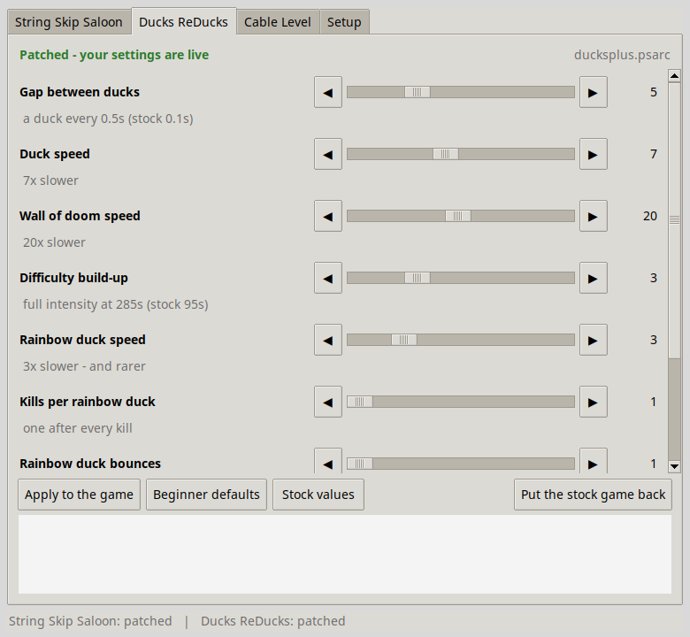
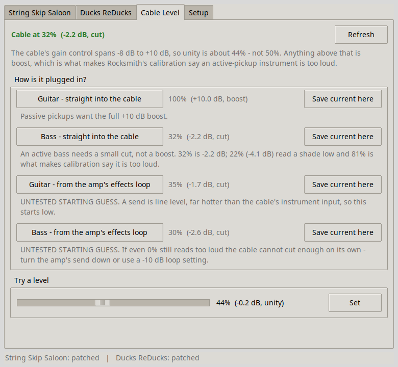

# Rocksmith Easy Mode

[](https://github.com/Ryan-Clinton/rocksmith-easy-mode/actions/workflows/tests.yml)

**Slow Rocksmith 2014's Guitarcade down to a pace a real beginner can play.**
Difficulty sliders for Ducks ReDucks and String Skip Saloon, with defaults
that came out of playtesting with an actual eight-year-old.

Ducks ReDucks and String Skip Saloon are two of the Guitarcade games most
often recommended to new players: Ducks for finding frets, Saloon for
finding strings. But they speed up faster than an absolute beginner can keep
up. When I handed the guitar to an eight-year-old, the ducks flew off before
he could find the fret, the wall of doom ended the run in seconds, and Saloon
fired targets faster than he could move between strings. This app slows both
games down to whatever pace suits the player.

**[Download for Windows](https://github.com/Ryan-Clinton/rocksmith-easy-mode/releases/latest)**
— extract the zip and run `RocksmithEasyMode.exe`. You also need
[7-Zip](https://7-zip.org). Linux and running from source are covered under
[Install](#install).



## What it does

**String Skip Saloon.** Gap between targets and target travel speed.

**Ducks ReDucks.** Gap between ducks, duck speed, wall-of-doom speed (a
separate slider, because the wall is what ends the run and needs slowing much
harder), difficulty build-up, rainbow duck speed, kills per rainbow duck,
rainbow duck bounces, and the fret range ducks may spawn on.

Every slider comes with a plain-English explanation of what its number means.
Move a slider, press *Apply to the game*, and restart Rocksmith.

**Safe to undo.** The original archive is backed up before the first change,
and one button puts the stock game back. Each rebuilt archive is read back
and checked before it replaces the game's file. If anything in the archive
isn't what the app expects, it refuses to patch rather than write half a
change.

**No game files are distributed.** The app only changes the files in your own
Rocksmith install, on your own machine.

**Also included: a Real Tone cable level helper.** The cable's gain control
spans −8 dB to +10 dB, so **unity is about 44%, not 50%**. Anything above
that is boost, which is why an active-pickup bass gets told it is too loud
during calibration. The app shows every level in dB as well as percent, with
starting-point presets for guitar and bass.



## Install

**Windows, ready to run.** [Download the latest
release](https://github.com/Ryan-Clinton/rocksmith-easy-mode/releases/latest),
extract it anywhere, and run `RocksmithEasyMode.exe`. Install
[7-Zip](https://7-zip.org) too, which the app uses to repack the game's
archives.

**Windows, from source.** You need **Python 3.8+** and **7-Zip**. Install
[Python](https://python.org), ticking *Add Python to PATH*, then:

```
pip install cryptography
```

Double-click `rocksmith-easy.pyw`, or run `rocksmith-easy.bat` for the
command line.

**Linux**

```sh
sudo apt install python3-tk p7zip-full python3-cryptography   # Debian/Ubuntu
sudo dnf install python3-tkinter p7zip python3-cryptography   # Fedora
./rocksmith-easy
```

Or install it properly with `pip install .`, which puts `rocksmith-easy` on
your PATH. `packaging/rocksmith-easy.desktop` adds it to a Linux app menu.

Steam installs are found automatically, including extra library folders and
Flatpak and Snap layouts. If yours is somewhere unusual, point at it once on
the Setup tab.

## Command line

The GUI is the default, but everything works headless:

```sh
rocksmith-easy info                              # what was found, what is patched
rocksmith-easy guitarcade ducks --defaults       # apply the tuned defaults
rocksmith-easy guitarcade ducks --wall 30 --speed 9
rocksmith-easy guitarcade saloon --stock         # put the stock game back
rocksmith-easy input bass-direct                 # set the cable for bass
rocksmith-easy input --level 40 --save-as bass-direct
```

Settings are remembered in `~/.config/rocksmith-easy/config.json`
(`%APPDATA%\rocksmith-easy\` on Windows). If you used the older
`rocksmith-input.conf` shell scripts, your cable presets are imported on first
run.

## The defaults, and why they are what they are

The shipped defaults are not guesses — they are where four rounds of
playtesting with an actual eight-year-old landed.

| Ducks ReDucks | Stock | Default | |
|---|---|---|---|
| Gap between ducks | 0.1 s | 0.5 s | ×5 |
| Duck speed | — | ×7 slower | |
| Wall of doom | — | ×20 slower | the wall is what ends the run |
| Difficulty build-up | 95 s to full | 285 s | ×3 |
| Rainbow duck speed | — | ×3 slower | |
| Kills per rainbow duck | 3 | 1 | |
| Rainbow duck bounces | 2 | 1 | |
| Fret range | 1–6 rising to 5–20 | 1–12 throughout | no reaching up the neck |

| String Skip Saloon | Stock | Default |
|---|---|---|
| Gap between targets | — | ×5 |
| Target travel speed | 125, 1000 | 62.5, 500 (×2 slower) |

Two of those deserve explaining, because both cost me a wrong theory first.

**Slowing rainbow ducks makes them rarer.** Only one can be active at a time,
and while it is bouncing the meter is frozen, so no new one can spawn. Slow
them too far and you get a whole half with none at all. The fix is *faster*
rainbow ducks with *fewer bounces*, not slower ones — which is the opposite of
what seems obvious.

**The wall and the rainbow ducks are coupled.** Rainbow ducks spawn at the
wall's position, so slowing the wall puts them much further away. Moving the
spawn point in `esedkp_gamemanager.lua` does nothing, because
`esedkp_rainbowduck.lua` re-pins the duck to the wall every single frame. The
app checks that coupling line is still present as a sanity check that it is
looking at the archive it thinks it is.

## Cable levels

These presets are starting points, not universal answers: pickup output
varies a lot from instrument to instrument.

| | Level | Gain | |
|---|---|---|---|
| Guitar, straight in | 100% | +10.0 dB | passive pickups want the boost |
| Bass, straight in | 32% | −2.2 dB | an active bass needs a cut |
| Guitar, effects loop | 35% | −1.7 dB | untested starting guess |
| Bass, effects loop | 30% | −2.6 dB | untested starting guess |

81% — a common suggestion online — is **+6.6 dB of boost**, and is exactly
what makes calibration complain.

On Linux the cable is deliberately hidden from PipeWire (Wine needs it as raw
ALSA), so `amixer` is the only way to change this, and the app does it for
you. It will also ask `alsactl` to store the level, because the cable
otherwise returns to +10 dB on every replug.

On Windows the app sets the same control through Windows' own audio API, in
dB. Windows' *Levels* slider uses a different scale: 32% in this app is
−2.2 dB, which is not 32 on that slider. **Rocksmith on Windows resets the
cable to 17% (−4.5 dB) every time it starts**, overwriting whatever was set
beforehand. So the app holds the level: leave it open while you play
(minimised is fine), and it puts the level back within a second whenever
something changes it. This is the same check-and-set that RSMods' *Override
input volume* does, without needing RSMods installed. From the command line,
`rocksmith-easy input bass-direct --hold` does the same until you press
Ctrl+C.

## Compatibility

Tested with the current Steam release of Rocksmith 2014 (Steam build
16576867) running under Proton on Linux. The Windows app is built and tested
automatically, but hasn't yet been tried against the game on Windows.

## Caveats

- Only the two minigames above are covered so far.
- The patch checks it is looking at the exact archive it was written for. On
  a Rocksmith build with different Guitarcade files it stops with an error
  and changes nothing. Please open an issue if that happens to you.
- Automatic cable-level setting works on Linux and Windows; macOS gets the
  number and instructions. On Windows the app has to stay open while you
  play, to undo the game's reset.
- The two effects-loop presets are untested starting guesses.
- This touches game files. That is what it is for, but Steam's *Verify
  integrity of game files* will replace them — just re-apply afterwards.

Not affiliated with Ubisoft. Rocksmith is their trademark.

---

*The rest is for the curious: how the patching works and how to run the
tests.*

## How the patching works

Guitarcade minigames live in `guitarcade/*.psarc`: an AES-256-CFB encrypted
table of contents over zlib blocks, containing a `.7z` of the game's xblock
definitions and Lua behaviours. To change a value the app decrypts the
archive, unpacks the inner `.7z`, edits the XML and Lua, repacks, and rebuilds
the psarc.

A few things it is careful about, each of which broke something first:

- **The pristine archive is copied to `.psarc.orig`** before the first patch,
  and every later patch rebuilds from *that*. Re-running with different
  numbers never compounds.
- **The rebuilt archive is read back and every payload compared** before it
  replaces the live file. A failed build leaves a `.new` file and touches
  nothing else.
- **The inner `.7z` must contain no directory entries.** The stock archives
  have none, and a 7-Zip that stores them hangs the game on the Guitarcade
  loading screen — so files are always added from an explicit list, never by
  adding `.`.
- **The member count is asserted** (166 for Saloon, 209 for Ducks), and every
  edit asserts it matched the expected number of sites. A different build of
  the game fails loudly rather than writing something half-applied.

## Tests

```sh
python3 -m unittest discover -s tests -v
```

The psarc, knob, cable-maths and config tests need nothing installed. If a
Rocksmith install and 7-Zip are present, two more tests patch the real game,
read the values back out of the archive, and restore whatever state they
found.

## Licence

MIT — see [LICENSE](LICENSE).
